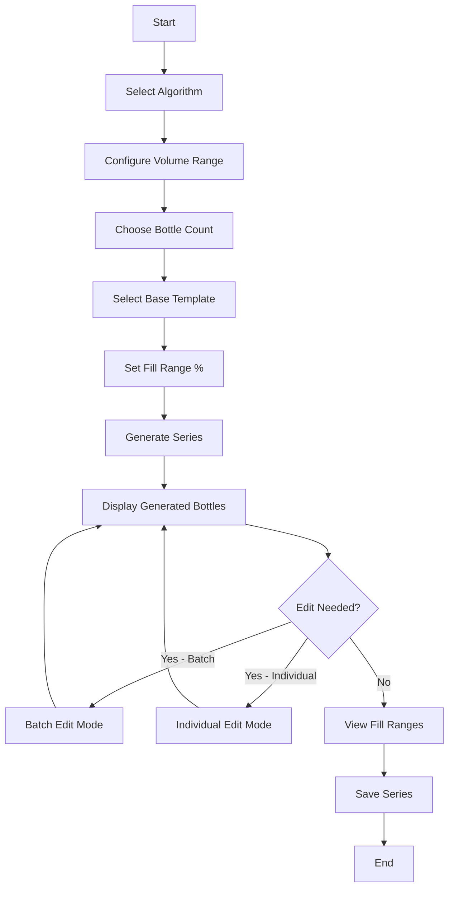
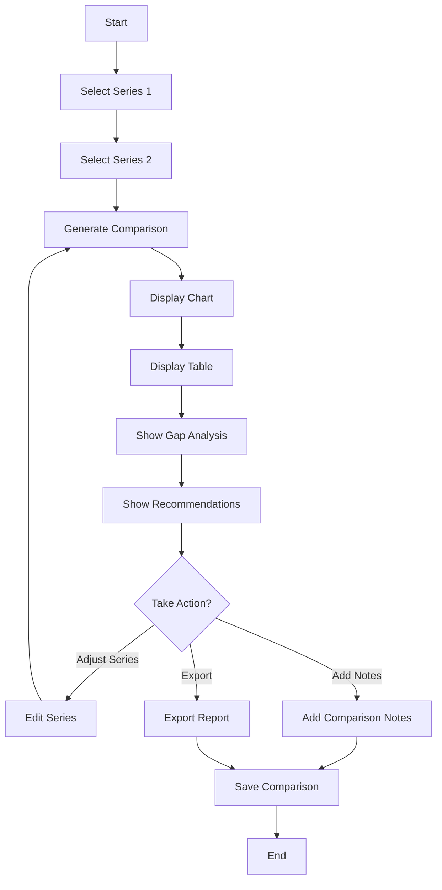
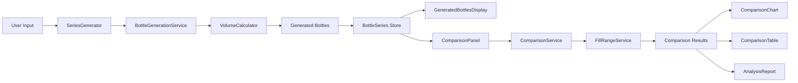

# Lineup Feature Redesign - Architectural Plan

## Executive Summary

This plan outlines the complete redesign of the PACK2 lineup feature, transforming it from a manual bottle arrangement system into an intelligent bottle series generator with fill range analysis and comparison capabilities.

## Current State Analysis

### Existing Features to Remove
1. **Manual Lineup Building**
   - Drag-and-drop bottle arrangement
   - Manual bottle selection from library
   - Custom ordering mode
   
2. **Basic Comparison**
   - Side-by-side lineup viewing
   - Simple rating system
   - Basic notes

### Existing Features to Preserve
- Volume calculation engine ([`volumeCalculator.ts`](../src/services/volumeCalculator.ts))
- 3D visualization components ([`Bottle3D.tsx`](../src/components/3d/Bottle3D.tsx), [`Scene3D.tsx`](../src/components/3d/Scene3D.tsx))
- Bottle type definitions ([`bottle.ts`](../src/types/bottle.ts))
- Core state management structure

## New Feature Requirements

### 1. Building a Lineup (Bottle Series Generation)

#### 1.1 Generation Algorithms
Generate series of bottles based on mathematical progressions:

- **Linear Progression**: Equal volume increments
  - Formula: `V(i) = V_min + (V_max - V_min) * i / (n-1)`
  - Example: 100ml, 200ml, 300ml, 400ml, 500ml

- **Golden Ratio**: Each bottle is φ (1.618) times the previous
  - Formula: `V(i) = V_min * φ^i`
  - Example: 100ml, 162ml, 262ml, 424ml, 686ml

- **Logarithmic Scale**: Logarithmic volume progression
  - Formula: `V(i) = exp(log(V_min) + (log(V_max) - log(V_min)) * i / (n-1))`
  - Example: 100ml, 158ml, 251ml, 398ml, 631ml

#### 1.2 User Inputs
- **Algorithm Selection**: Linear, Golden Ratio, Logarithmic
- **Volume Range**: 
  - Minimum volume (default: 65 mL)
  - Maximum volume (default: 700 mL)
- **Number of Bottles**: 3-10 bottles in series
- **Base Bottle Template**: Select from existing bottle shapes
- **Scaling Strategy**: Prioritize height changes over diameter changes

#### 1.3 Bottle Generation Process
1. Calculate target volumes using selected algorithm
2. Select base bottle template
3. Scale bottle dimensions to match target volumes:
   - Primary scaling: Adjust body height
   - Secondary scaling: Adjust diameter if height limits reached
   - Preserve: Neck dimensions, cap size (when possible)
   - Recalculate: Volume, surface area
4. Create new bottle objects with unique IDs
5. Add to bottle series collection

#### 1.4 Batch/Individual Editing
- **Batch Edit Mode**:
  - Select multiple bottles in series
  - Edit common properties: material, cap style, colors
  - Apply proportional dimensional changes
  
- **Individual Edit Mode**:
  - Full parameter editing for single bottle
  - All properties editable: dimensions, materials, colors, cap style
  - Real-time volume recalculation
  - Visual preview of changes

#### 1.5 Display Generated Bottles
- **3D Shelf View**: Show all bottles in series on virtual shelf
- **List View**: Tabular display with key specifications
- **Specifications Panel**: Detailed specs for selected bottle
  - Volume, dimensions, surface area
  - Material, cap style
  - Fill range calculations

#### 1.6 Fill Range Calculation
For each bottle, calculate the mL range for target fill percentages:

**Formula**: 
```
Fill_mL = Bottle_Volume * Fill_Percentage / 100
```

**Default Fill Range**: 65% to 85%

**Display**:
- Minimum fill (65%): `Volume * 0.65` mL
- Target fill (75%): `Volume * 0.75` mL
- Maximum fill (85%): `Volume * 0.85` mL

**Example** (200 mL bottle):
- Min fill: 130 mL (65%)
- Target: 150 mL (75%)
- Max fill: 170 mL (85%)

### 2. Compare Lineups (Gap Analysis)

#### 2.1 Comparison Scope
Compare 2 bottle series to identify:
- **Coverage Gaps**: Volume ranges not covered by either series
- **Overlaps**: Volume ranges covered by both series
- **Optimal Coverage**: Which series provides better coverage
- **Fill Range Conflicts**: Where fill ranges create ambiguity

#### 2.2 Gap Analysis Algorithm

```typescript
interface FillRange {
  bottleId: string;
  bottleVolume: number;
  minFill: number;    // mL at min %
  maxFill: number;    // mL at max %
  minPercent: number; // default 65%
  maxPercent: number; // default 85%
}

interface CoverageGap {
  startVolume: number;
  endVolume: number;
  gapSize: number;
}

interface CoverageOverlap {
  startVolume: number;
  endVolume: number;
  series1Bottles: string[];
  series2Bottles: string[];
}
```

**Gap Detection Logic**:
1. Calculate fill ranges for all bottles in both series
2. Sort all ranges by minimum fill volume
3. Identify gaps where no bottle can accommodate a volume
4. Calculate gap sizes and positions
5. Identify overlaps where multiple bottles can accommodate same volume

#### 2.3 Visual Comparison Chart

**Chart Type**: Horizontal bar chart with dual series

**Layout**:
```
Series 1: [====Bottle1====] [====Bottle2====] [====Bottle3====]
          |--gap--|         |--gap--|
Series 2:    [====Bottle1====]  [====Bottle2====]  [====Bottle3====]

Volume:   0   100   200   300   400   500   600   700 mL
```

**Visual Elements**:
- **Bottle Bars**: Colored bars showing fill range (min to max)
- **Gap Indicators**: Red highlighted regions showing coverage gaps
- **Overlap Indicators**: Yellow highlighted regions showing overlaps
- **Target Line**: Vertical line showing a specific target volume
- **Tooltips**: Hover to see exact values

**Color Coding**:
- Series 1: Blue gradient
- Series 2: Green gradient
- Gaps: Red with diagonal stripes
- Overlaps: Yellow with crosshatch
- Optimal coverage: Green checkmark
- Poor coverage: Red warning

#### 2.4 Detailed Comparison Table

**Table Columns**:
| Bottle | Volume (mL) | Min Fill (mL) | Target Fill (mL) | Max Fill (mL) | Coverage Range |
|--------|-------------|---------------|------------------|---------------|----------------|
| Series 1 - Bottle 1 | 100 | 65 | 75 | 85 | 65-85 mL |
| Series 1 - Bottle 2 | 200 | 130 | 150 | 170 | 130-170 mL |
| **GAP** | - | - | - | - | **85-130 mL** |
| Series 2 - Bottle 1 | 150 | 98 | 113 | 128 | 98-128 mL |

**Additional Metrics**:
- Total coverage percentage
- Number of gaps
- Largest gap size
- Average gap size
- Overlap count
- Overlap percentage

#### 2.5 Gap Analysis Report

**Summary Statistics**:
```
Coverage Analysis
├── Series 1: 78% coverage (3 gaps)
├── Series 2: 82% coverage (2 gaps)
├── Combined: 95% coverage (1 gap)
└── Recommendation: Use Series 2 with 1 additional bottle
```

**Gap Details**:
```
Gap 1: 85-130 mL (45 mL gap)
  - Recommendation: Add 110 mL bottle to Series 1
  
Gap 2: 340-380 mL (40 mL gap)
  - Recommendation: Adjust Series 2 Bottle 3 to 360 mL
```

## Technical Architecture

### 3.1 New Type Definitions

```typescript
// src/types/bottleSeries.ts

export type GenerationAlgorithm = 
  | 'linear'
  | 'golden-ratio'
  | 'logarithmic';

export interface GenerationConfig {
  algorithm: GenerationAlgorithm;
  minVolume: number;        // mL
  maxVolume: number;        // mL
  bottleCount: number;      // 3-10
  baseTemplateId: string;   // Reference to bottle template
  fillRangeMin: number;     // % (default 65)
  fillRangeMax: number;     // % (default 85)
}

export interface BottleSeries {
  id: string;
  name: string;
  description: string;
  config: GenerationConfig;
  bottles: Bottle[];        // Generated bottles
  
  // Metadata
  createdAt: Date;
  updatedAt: Date;
  category: string;
}

export interface FillRange {
  bottleId: string;
  bottleVolume: number;
  minFill: number;          // mL at min %
  targetFill: number;       // mL at target %
  maxFill: number;          // mL at max %
  minPercent: number;
  targetPercent: number;
  maxPercent: number;
}

export interface CoverageGap {
  startVolume: number;
  endVolume: number;
  gapSize: number;
  severity: 'minor' | 'moderate' | 'major';
}

export interface CoverageOverlap {
  startVolume: number;
  endVolume: number;
  overlapSize: number;
  series1Bottles: string[];
  series2Bottles: string[];
}

export interface SeriesComparison {
  id: string;
  name: string;
  series1Id: string;
  series2Id: string;
  
  // Analysis results
  gaps: CoverageGap[];
  overlaps: CoverageOverlap[];
  series1Coverage: number;  // %
  series2Coverage: number;  // %
  combinedCoverage: number; // %
  
  // Recommendations
  recommendations: string[];
  
  // Metadata
  notes: string;
  createdAt: Date;
}
```

### 3.2 Service Layer

#### 3.2.1 Bottle Generation Service

```typescript
// src/services/bottleGenerationService.ts

export class BottleGenerationService {
  
  /**
   * Generate bottle series based on algorithm
   */
  static generateSeries(config: GenerationConfig): Bottle[] {
    // 1. Calculate target volumes
    const volumes = this.calculateVolumes(config);
    
    // 2. Get base template
    const template = this.getTemplate(config.baseTemplateId);
    
    // 3. Generate bottles
    return volumes.map((volume, index) => 
      this.scaleBottleToVolume(template, volume, index)
    );
  }
  
  /**
   * Calculate target volumes using algorithm
   */
  private static calculateVolumes(config: GenerationConfig): number[] {
    switch (config.algorithm) {
      case 'linear':
        return this.linearProgression(
          config.minVolume, 
          config.maxVolume, 
          config.bottleCount
        );
      case 'golden-ratio':
        return this.goldenRatioProgression(
          config.minVolume, 
          config.maxVolume, 
          config.bottleCount
        );
      case 'logarithmic':
        return this.logarithmicProgression(
          config.minVolume, 
          config.maxVolume, 
          config.bottleCount
        );
    }
  }
  
  /**
   * Scale bottle dimensions to match target volume
   * Priority: Height > Diameter > Other dimensions
   */
  private static scaleBottleToVolume(
    template: Bottle, 
    targetVolume: number,
    index: number
  ): Bottle {
    // 1. Calculate scaling factor
    const volumeRatio = targetVolume / template.volume;
    
    // 2. Try height-only scaling first
    let scaledBottle = this.scaleHeight(template, volumeRatio);
    
    // 3. If height limits reached, scale diameter
    if (!this.isValidBottle(scaledBottle)) {
      scaledBottle = this.scaleHeightAndDiameter(template, volumeRatio);
    }
    
    // 4. Recalculate volume
    scaledBottle.volume = VolumeCalculator.calculateVolume(scaledBottle);
    
    // 5. Generate unique ID and name
    scaledBottle.id = generateId();
    scaledBottle.name = `${template.name} ${targetVolume}ml`;
    
    return scaledBottle;
  }
  
  /**
   * Scale bottle height to achieve target volume
   */
  private static scaleHeight(bottle: Bottle, ratio: number): Bottle {
    // For cylindrical approximation: V ∝ h
    // So height scaling factor ≈ volume ratio
    const newBottle = { ...bottle };
    newBottle.dimensions.bodyHeight *= ratio;
    newBottle.dimensions.height = 
      newBottle.dimensions.bodyHeight + 
      newBottle.dimensions.neckHeight;
    return newBottle;
  }
  
  /**
   * Scale both height and diameter
   */
  private static scaleHeightAndDiameter(
    bottle: Bottle, 
    ratio: number
  ): Bottle {
    // For cylinder: V ∝ r² × h
    // Use cube root for proportional scaling
    const linearScale = Math.cbrt(ratio);
    
    const newBottle = { ...bottle };
    newBottle.dimensions.bodyHeight *= linearScale;
    newBottle.dimensions.diameter *= linearScale;
    newBottle.dimensions.baseDiameter *= linearScale;
    // Keep neck dimensions constant
    
    return newBottle;
  }
}
```

#### 3.2.2 Fill Range Service

```typescript
// src/services/fillRangeService.ts

export class FillRangeService {
  
  /**
   * Calculate fill range for a bottle
   */
  static calculateFillRange(
    bottle: Bottle,
    minPercent: number = 65,
    maxPercent: number = 85
  ): FillRange {
    const targetPercent = (minPercent + maxPercent) / 2;
    
    return {
      bottleId: bottle.id,
      bottleVolume: bottle.volume,
      minFill: bottle.volume * minPercent / 100,
      targetFill: bottle.volume * targetPercent / 100,
      maxFill: bottle.volume * maxPercent / 100,
      minPercent,
      targetPercent,
      maxPercent,
    };
  }
  
  /**
   * Calculate fill ranges for entire series
   */
  static calculateSeriesFillRanges(
    series: BottleSeries
  ): FillRange[] {
    return series.bottles.map(bottle =>
      this.calculateFillRange(
        bottle,
        series.config.fillRangeMin,
        series.config.fillRangeMax
      )
    );
  }
}
```

#### 3.2.3 Comparison Service

```typescript
// src/services/comparisonService.ts

export class ComparisonService {
  
  /**
   * Compare two bottle series
   */
  static compareSeries(
    series1: BottleSeries,
    series2: BottleSeries
  ): SeriesComparison {
    // 1. Calculate fill ranges
    const ranges1 = FillRangeService.calculateSeriesFillRanges(series1);
    const ranges2 = FillRangeService.calculateSeriesFillRanges(series2);
    
    // 2. Find gaps
    const gaps = this.findGaps(ranges1, ranges2);
    
    // 3. Find overlaps
    const overlaps = this.findOverlaps(ranges1, ranges2);
    
    // 4. Calculate coverage
    const coverage = this.calculateCoverage(ranges1, ranges2, gaps);
    
    // 5. Generate recommendations
    const recommendations = this.generateRecommendations(gaps, overlaps);
    
    return {
      id: generateId(),
      name: `${series1.name} vs ${series2.name}`,
      series1Id: series1.id,
      series2Id: series2.id,
      gaps,
      overlaps,
      series1Coverage: coverage.series1,
      series2Coverage: coverage.series2,
      combinedCoverage: coverage.combined,
      recommendations,
      notes: '',
      createdAt: new Date(),
    };
  }
  
  /**
   * Find coverage gaps
   */
  private static findGaps(
    ranges1: FillRange[],
    ranges2: FillRange[]
  ): CoverageGap[] {
    const gaps: CoverageGap[] = [];
    
    // Combine and sort all ranges
    const allRanges = [...ranges1, ...ranges2]
      .sort((a, b) => a.minFill - b.minFill);
    
    // Find gaps between consecutive ranges
    for (let i = 0; i < allRanges.length - 1; i++) {
      const currentMax = allRanges[i].maxFill;
      const nextMin = allRanges[i + 1].minFill;
      
      if (nextMin > currentMax) {
        const gapSize = nextMin - currentMax;
        gaps.push({
          startVolume: currentMax,
          endVolume: nextMin,
          gapSize,
          severity: this.assessGapSeverity(gapSize),
        });
      }
    }
    
    return gaps;
  }
  
  /**
   * Find coverage overlaps
   */
  private static findOverlaps(
    ranges1: FillRange[],
    ranges2: FillRange[]
  ): CoverageOverlap[] {
    const overlaps: CoverageOverlap[] = [];
    
    // Check each range in series1 against series2
    for (const range1 of ranges1) {
      for (const range2 of ranges2) {
        const overlapStart = Math.max(range1.minFill, range2.minFill);
        const overlapEnd = Math.min(range1.maxFill, range2.maxFill);
        
        if (overlapStart < overlapEnd) {
          overlaps.push({
            startVolume: overlapStart,
            endVolume: overlapEnd,
            overlapSize: overlapEnd - overlapStart,
            series1Bottles: [range1.bottleId],
            series2Bottles: [range2.bottleId],
          });
        }
      }
    }
    
    return overlaps;
  }
  
  /**
   * Calculate coverage percentages
   */
  private static calculateCoverage(
    ranges1: FillRange[],
    ranges2: FillRange[],
    gaps: CoverageGap[]
  ): { series1: number; series2: number; combined: number } {
    // Calculate total range
    const allRanges = [...ranges1, ...ranges2];
    const minVolume = Math.min(...allRanges.map(r => r.minFill));
    const maxVolume = Math.max(...allRanges.map(r => r.maxFill));
    const totalRange = maxVolume - minVolume;
    
    // Calculate covered ranges
    const series1Coverage = this.calculateSeriesCoverage(ranges1);
    const series2Coverage = this.calculateSeriesCoverage(ranges2);
    
    // Calculate combined coverage (total - gaps)
    const totalGapSize = gaps.reduce((sum, gap) => sum + gap.gapSize, 0);
    const combinedCoverage = ((totalRange - totalGapSize) / totalRange) * 100;
    
    return {
      series1: (series1Coverage / totalRange) * 100,
      series2: (series2Coverage / totalRange) * 100,
      combined: combinedCoverage,
    };
  }
  
  /**
   * Generate recommendations
   */
  private static generateRecommendations(
    gaps: CoverageGap[],
    overlaps: CoverageOverlap[]
  ): string[] {
    const recommendations: string[] = [];
    
    // Recommend filling major gaps
    const majorGaps = gaps.filter(g => g.severity === 'major');
    for (const gap of majorGaps) {
      const suggestedVolume = (gap.startVolume + gap.endVolume) / 2;
      recommendations.push(
        `Add bottle with ${suggestedVolume.toFixed(0)}mL capacity to fill gap at ${gap.startVolume.toFixed(0)}-${gap.endVolume.toFixed(0)}mL`
      );
    }
    
    // Recommend reducing excessive overlaps
    if (overlaps.length > 3) {
      recommendations.push(
        `Consider reducing overlaps - ${overlaps.length} overlapping ranges detected`
      );
    }
    
    return recommendations;
  }
}
```

### 3.3 Component Architecture

#### 3.3.1 Component Hierarchy

```
LineupBuilder (Main Container)
├── SeriesGenerator
│   ├── AlgorithmSelector
│   ├── VolumeRangeInput
│   ├── BottleCountSelector
│   ├── TemplateSelector
│   ├── FillRangeConfig
│   └── GenerateButton
├── GeneratedBottlesDisplay
│   ├── BottleSeriesShelf3D
│   ├── BottleSeriesList
│   └── BottleSpecsPanel
├── BatchEditor
│   ├── BatchEditControls
│   └── BottleSelectionGrid
└── IndividualEditor
    ├── DimensionEditor
    ├── MaterialEditor
    ├── ColorEditor
    └── CapStyleEditor

ComparisonPanel (Main Container)
├── SeriesSelector
│   ├── Series1Selector
│   └── Series2Selector
├── ComparisonChart
│   ├── FillRangeVisualization
│   ├── GapIndicators
│   └── OverlapIndicators
├── ComparisonTable
│   ├── BottleRowsSeries1
│   ├── BottleRowsSeries2
│   └── GapRows
├── AnalysisReport
│   ├── CoverageMetrics
│   ├── GapAnalysis
│   └── Recommendations
└── ComparisonNotes
```

#### 3.3.2 Key Components

**SeriesGenerator Component**
```typescript
// src/components/lineup-builder/SeriesGenerator.tsx

interface SeriesGeneratorProps {
  onGenerate: (series: BottleSeries) => void;
}

export default function SeriesGenerator({ onGenerate }: SeriesGeneratorProps) {
  const [config, setConfig] = useState<GenerationConfig>({
    algorithm: 'linear',
    minVolume: 65,
    maxVolume: 700,
    bottleCount: 5,
    baseTemplateId: '',
    fillRangeMin: 65,
    fillRangeMax: 85,
  });
  
  const handleGenerate = () => {
    const bottles = BottleGenerationService.generateSeries(config);
    const series: BottleSeries = {
      id: generateId(),
      name: 'New Series',
      description: '',
      config,
      bottles,
      createdAt: new Date(),
      updatedAt: new Date(),
      category: '',
    };
    onGenerate(series);
  };
  
  return (
    // UI for configuration and generation
  );
}
```

**ComparisonChart Component**
```typescript
// src/components/comparison-mode/ComparisonChart.tsx

interface ComparisonChartProps {
  series1: BottleSeries;
  series2: BottleSeries;
  comparison: SeriesComparison;
}

export default function ComparisonChart({ 
  series1, 
  series2, 
  comparison 
}: ComparisonChartProps) {
  // Calculate fill ranges
  const ranges1 = FillRangeService.calculateSeriesFillRanges(series1);
  const ranges2 = FillRangeService.calculateSeriesFillRanges(series2);
  
  return (
    <div className="comparison-chart">
      {/* Series 1 bars */}
      <div className="series-row">
        {ranges1.map(range => (
          <FillRangeBar key={range.bottleId} range={range} color="blue" />
        ))}
      </div>
      
      {/* Gap indicators */}
      <div className="gap-row">
        {comparison.gaps.map((gap, i) => (
          <GapIndicator key={i} gap={gap} />
        ))}
      </div>
      
      {/* Series 2 bars */}
      <div className="series-row">
        {ranges2.map(range => (
          <FillRangeBar key={range.bottleId} range={range} color="green" />
        ))}
      </div>
      
      {/* Volume axis */}
      <VolumeAxis min={0} max={800} />
    </div>
  );
}
```

### 3.4 State Management Updates

```typescript
// src/store/index.ts - Add to Zustand store

interface AppState {
  // ... existing state ...
  
  // New state for bottle series
  bottleSeries: Record<string, BottleSeries>;
  activeSeriesId: string | null;
  
  // New state for comparisons
  seriesComparisons: Record<string, SeriesComparison>;
  activeComparisonId: string | null;
  
  // Actions
  createBottleSeries: (config: GenerationConfig) => string;
  updateBottleSeries: (id: string, updates: Partial<BottleSeries>) => void;
  deleteBottleSeries: (id: string) => void;
  setActiveSeries: (id: string | null) => void;
  
  updateBottleInSeries: (seriesId: string, bottleId: string, updates: Partial<Bottle>) => void;
  batchUpdateBottles: (seriesId: string, bottleIds: string[], updates: Partial<Bottle>) => void;
  
  createSeriesComparison: (series1Id: string, series2Id: string) => string;
  updateSeriesComparison: (id: string, updates: Partial<SeriesComparison>) => void;
  deleteSeriesComparison: (id: string) => void;
  setActiveComparison: (id: string | null) => void;
}
```

## Migration Strategy

### Phase 1: Preserve Existing Data
1. Keep existing [`lineup.ts`](../src/types/lineup.ts) types for backward compatibility
2. Add new [`bottleSeries.ts`](../src/types/bottleSeries.ts) types alongside
3. Maintain existing lineup data in store

### Phase 2: Implement New Features
1. Create new services (generation, fill range, comparison)
2. Build new components (series generator, comparison chart)
3. Add new state management for bottle series
4. Keep existing lineup builder functional

### Phase 3: Update UI
1. Add new tabs/sections for series generation
2. Update comparison panel with new visualization
3. Maintain existing features during transition

### Phase 4: Deprecation (Optional)
1. Provide migration tool to convert old lineups to series
2. Mark old lineup builder as deprecated
3. Eventually remove old lineup code

## User Interface Flow

### Building a Lineup Flow



### Comparing Lineups Flow



## Data Flow Diagram



## Implementation Priorities

### High Priority (Core Functionality)
1. Bottle generation algorithms (linear, golden ratio, logarithmic)
2. Volume-to-dimension scaling logic
3. Fill range calculation
4. Basic series display (3D shelf + list)
5. Gap analysis algorithm
6. Basic comparison chart

### Medium Priority (Enhanced Features)
1. Batch editing capabilities
2. Individual bottle editing
3. Detailed comparison table
4. Recommendations engine
5. Coverage metrics
6. Visual gap indicators

### Low Priority (Polish)
1. Advanced chart interactions (zoom, pan)
2. Export comparison reports
3. Series templates/presets
4. Historical comparison tracking
5. Optimization suggestions
6. A/B testing features

## Technical Considerations

### Performance
- **Bottle Generation**: O(n) where n = bottle count (typically 3-10)
- **Gap Analysis**: O(n log n) for sorting ranges
- **Comparison**: O(n²) worst case for overlap detection
- **Optimization**: Cache calculated fill ranges

### Validation
- Minimum volume must be > 0
- Maximum volume must be > minimum volume
- Bottle count must be 3-10
- Fill range percentages must be 0-100
- Base template must exist

### Error Handling
- Invalid volume ranges → Show error message
- Scaling failures → Fall back to proportional scaling
- Missing templates → Use default template
- Comparison with deleted series → Show warning

### Testing Strategy
- Unit tests for all algorithms
- Integration tests for generation flow
- Visual regression tests for charts
- E2E tests for complete workflows

## Success Metrics

### Functional Metrics
- Successfully generate series with all 3 algorithms
- Accurate volume calculations (within 1% tolerance)
- Correct gap detection (100% accuracy)
- Fill range calculations match specifications

### User Experience Metrics
- Series generation time < 1 second
- Comparison analysis time < 2 seconds
- Chart rendering time < 500ms
- Smooth editing experience (no lag)

### Quality Metrics
- Test coverage > 80%
- Zero critical bugs in production
- Positive user feedback on new features
- Reduced time to create lineups (vs old method)

## Documentation Updates

### README.md Updates
Replace sections:
- "Building a Lineup" → New generation workflow
- "Comparing Lineups" → New gap analysis features

Add sections:
- "Bottle Series Generation Algorithms"
- "Fill Range Analysis"
- "Coverage Gap Detection"

### Code Documentation
- JSDoc comments for all new services
- Type documentation for new interfaces
- Algorithm explanations with examples
- Usage examples for components

## Future Enhancements

### Phase 2 Features
1. **Multi-series comparison**: Compare 3+ series simultaneously
2. **Optimization engine**: Suggest optimal bottle sizes
3. **Cost analysis**: Factor in manufacturing costs
4. **Market analysis**: Compare against competitor lineups
5. **Custom algorithms**: User-defined generation formulas
6. **AI recommendations**: ML-based lineup suggestions

### Integration Opportunities
1. **ERP integration**: Import/export to manufacturing systems
2. **PLM integration**: Connect to product lifecycle management
3. **Analytics dashboard**: Track lineup performance over time
4. **Collaboration features**: Share and review lineups with team

## Conclusion

This redesign transforms the lineup feature from a manual arrangement tool into an intelligent bottle series generator with sophisticated analysis capabilities. The new system will:

1. **Accelerate workflow**: Generate complete series in seconds vs manual creation
2. **Improve quality**: Mathematical algorithms ensure optimal spacing
3. **Enhance analysis**: Gap detection identifies coverage issues
4. **Support decisions**: Recommendations guide optimization
5. **Maintain flexibility**: Full editing capabilities preserved

The architecture is designed for extensibility, allowing future enhancements while maintaining clean separation of concerns and testability.
